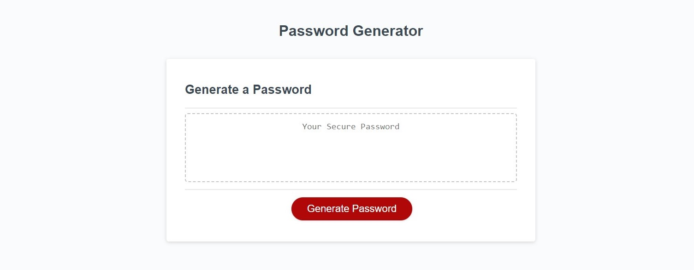
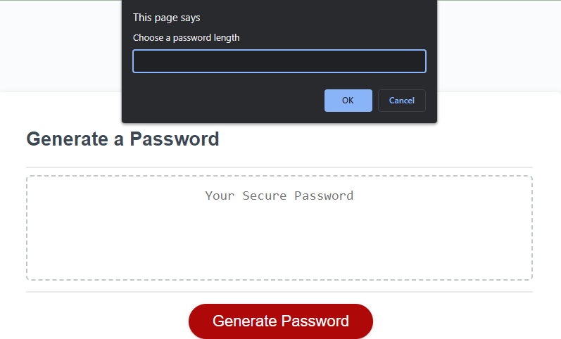
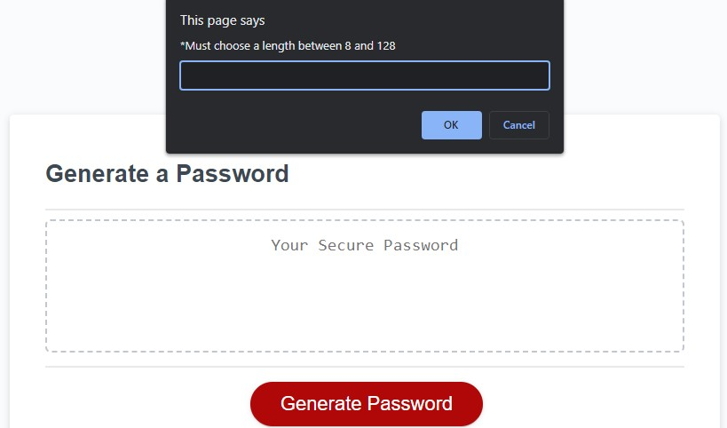
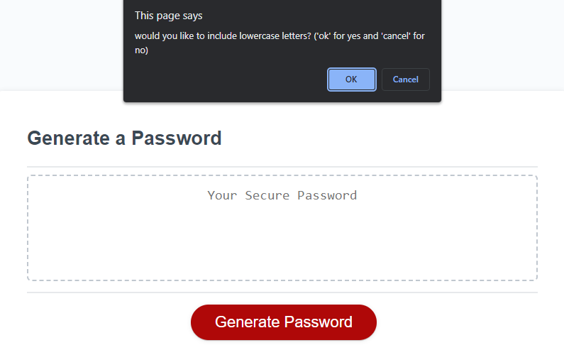
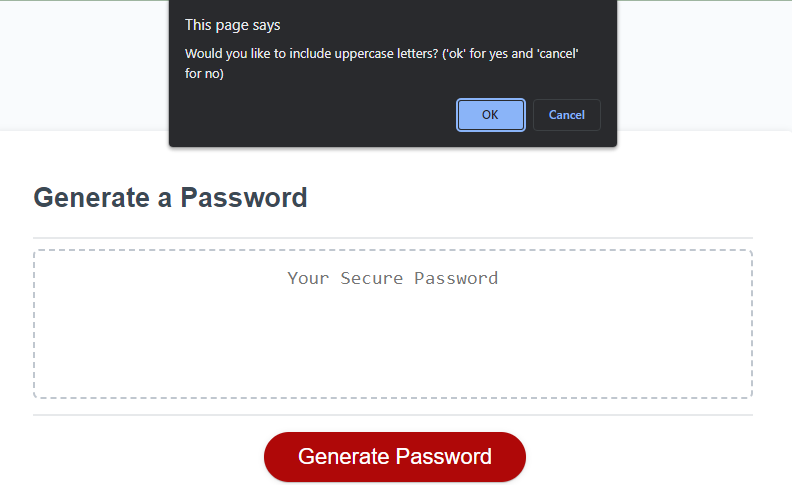
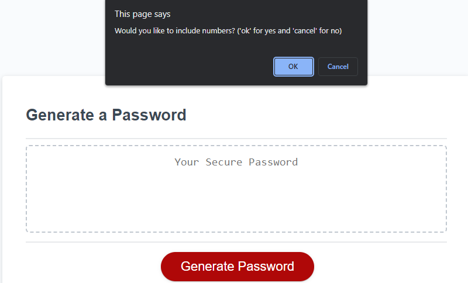
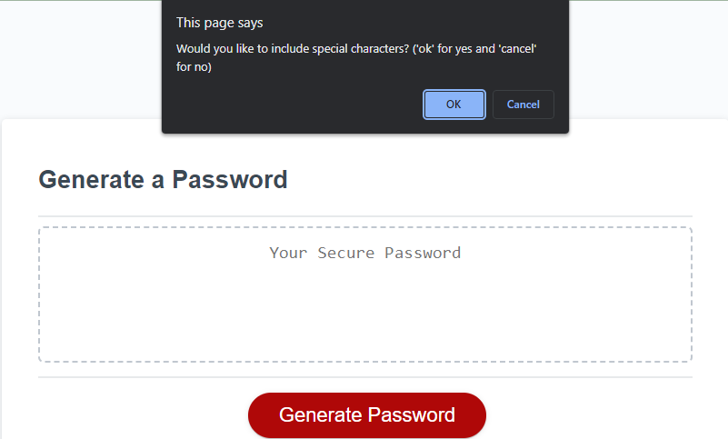
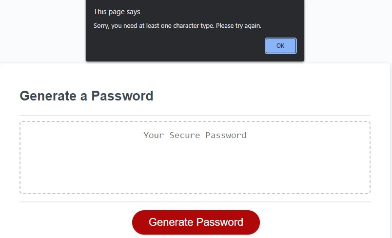
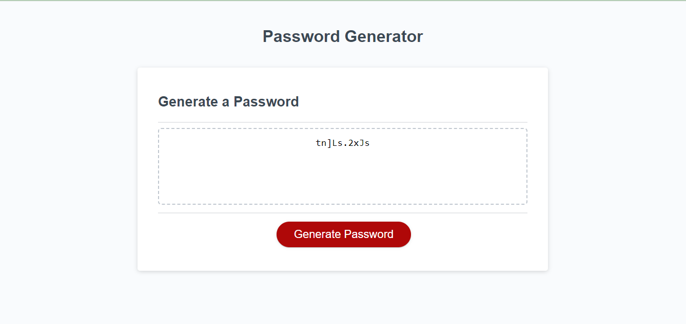

# Password Generator

## Description

This project is a random password generator that is capable of receiving user input and producing a string of characters based on the user criteria. The intention is to generate a secure password that allows the user to feel confident when protecting sensitive data. This is done through Javascript with the help of methods, functions, loops and math logic.

## Deployed Application Link:

https://jjocelynn.github.io/password-generator/

## Usage

When the user clicks the "Generate Password" button, a function runs that will ask the user various prompts. Depending on the user's answer, an if statement will generate a random set of characters in a random order and display it on the screen.

screen upon loading:

prompt asking the user to choose a length for their password:

If the user enters a number lower than 8, higher than 128, or a letter, the prompt will require them to choose again.

asking if the user would like to include lowercase letters:

asking if the user would like to include uppercase letters:

asking if the user would like to include numbers:

asking if the user would like to include special characters:

if the user chooses no character types, the function will end and ask them to try again

Depending on the length and character type(s) the user has requested, the program will display a string of characters that meet the requirement.

## Credits

kodeclik (shuffle letters in a word): https://www.kodeclik.com/how-to-scramble-a-word-in-javascript/

## License

Please refer to the LICENSE in the repo
